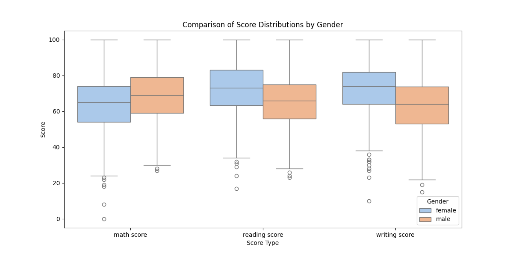

# Student Performance Prediction – CSC 535 Final Project

This project was developed as part of a group assignment for CSC 535: Data Mining. The goal was to use machine learning techniques to predict student test scores based on socioeconomic and educational background factors.

We worked with a dataset containing information about students' gender, parental education, lunch status, and test preparation course, alongside their scores in math, reading, and writing.

## Project Objectives

- Predict individual and average test scores using various regression models
- Explore relationships between demographic features and performance
- Compare model performance using standard evaluation metrics
- Visualize results through graphs and charts

## Methods and Tools

- **Language:** Python
- **Libraries:** pandas, scikit-learn, matplotlib, seaborn
- **Models:** Random Forest, Decision Tree, Neural Network (MLP)
- **Dataset:** StudentsPerformance.csv

Each model was trained on selected features and evaluated on math, reading, writing, and average scores.

## Process Overview

- Load and explore the dataset
- Encoded categorical variables
- Create new features (e.g., average score)
- Trained and tested three regression models.
- Evaluated model performance using Mean Squared Error (MSE) and R²
- Visualized score distributions and predictions

## Installation

To install the dependencies locally use: 
```bash
pip install -r requirements.txt
```

## Example Visualization

Below is a sample plot showing the distribution of test scores by gender, using boxplots for math, reading, and writing scores.



This chart was generated using seaborn and matplotlib to explore patterns in score distributions by gender.

## Notes

This project was originally a collaborative effort. This version has been adapted for portfolio use, with names removed for privacy.